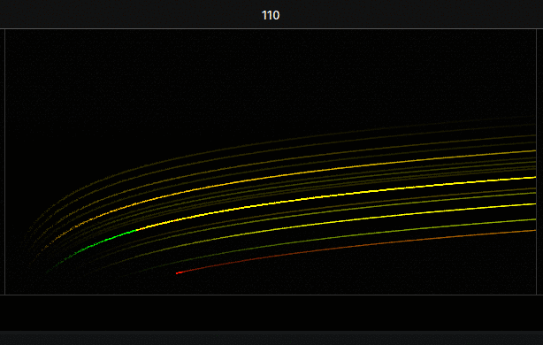

## About

Adding instruments to the graphical score is the key to produce sounds.

Instruments are added by adding slices to the graphical score, a slice is the support for an instrument which will by default be of additive synthesis type.

The purpose of slices is to capture the bitmap-data of the score canvas, the captured pixels data (R, G, B, A) will be fed to the audio synthesis engine in real-time and produce sounds from the attached instrument type, slices are like turntable needles, they can be dragged around in real-time with the mouse.

Double-clicking on the canvas bring the instruments dialog which show an overview of all current slices / instruments and short informations about it, you can click on an item to open the slice settings dialog or right-click on an item to bring the slice menu.

## How-to

Slices can be added by right clicking on the canvas and clicking on the add button.

Slices are referenced by their index (roughly equivalent to the order they were added) which is shown in the title bar of the slice settings dialog.

Once added an instrument can be assigned to the slice in the **SYNTH** dialog (by clicking on the **SYNTH** toolbar button, see Synth / Audio Server), additive synthesis type instrument is assigned by default.

Slices can be moved by dragging them on the X axis, to do so, maintain the left mouse button on a slice and move the mouse cursor around on the horizontal axis.

The following actions are possible when right-clicking on a slice

delete

- the slice will be deleted

mute/unmute

- the slice will not output anything (muted)

Double-clicking on a slice open its settings dialog :

open slice settings dialog

- X Offset: the slice horizontal position
- Y Shift: offset the slice vertically by some amount (frequency band offset; has no visual indication)
- Increment per frame: This allow the slice to move left or right autonomously
- Output channel index (virtual; has no relation with physical output channel)
- AUDIO out: Enable/disable audio output for this slice
- OSC out: Enable/disable OSC output for this slice
- MIDI out: Enable/disable MIDI output for this slice
    - one or multiple (with shift + click) MIDI devices can be selected from the **Devices** list (see MIDI)
    - open MIDI OUT editor: show the editor for custom MIDI OUT messages

##### Muting a slice

##### Deleting a slice

