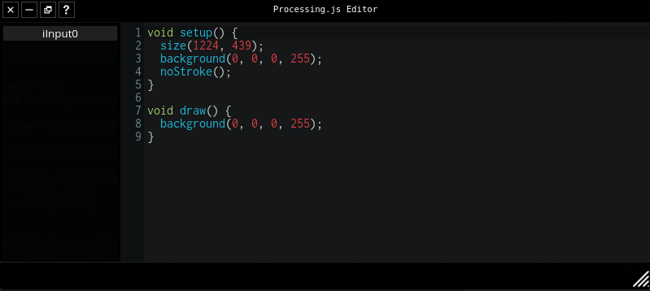

## About

Fragment support [Processing.js](https://en.wikipedia.org/wiki/Processing.js) scripting via the Pjs button of the import dialog.

Fragment has full support for the Processing.js visualization language, the Processing.js sketch is rendered into a texture and passed to the fragment shader.

Processing.js is a JavaScript port of Processing, a programming language designed to write visualisations, images, and interactive content.

This powerful feature allow to use multiple Processing.js script as a Fragment input. It is also compatible with most Processing scripts.

Processing.js is like Fragment second language, it does not replace GLSL but is a logical complement to the fragment shader, it may be used independently and may be easier to learn with about the same possibilities (maybe more) altough slower.

When a Pjs input is added the Processing.js scripts editor can be accessed by **right clicking** on the Pjs input thumbnail.

The editor contain the complete list of Pjs inputs on the left and the code editor to the right.

Code between Pjs inputs can be switched quickly by cliking on a Pjs input name in the list of Pjs inputs.

Compilation status appear at the bottom end of the Pjs editor dialog.

All changes done in the Pjs editor are updated in real-time as you type.

Note : Fragment automatically change the `size` function `width` and `height` arguments to match the canvas size, it also automatically add a black background in the setup function as protective measure.

When clicking on a Pjs input thumbnail a menu appear with several options :

* the input settings (similar to other imports)
* input deletion (similar to other imports)
* rewind : will rewind the sketch / script `globalTime` variable
* open Processing.js editor (same thing as right clicking on a Pjs input thumbnail)

Each Pjs script / sketch have their own pre-defined `globalTime` global variable.

There is also some pre-defined variables and functions accessible in any Processing.js scripts :

* float globalTime
    * sketch playback time (seconds) can be reset by clicking on the rewind button of the input menu
* float baseFrequency
    * ​score base frequency (hertz)
* float octave
    * ​score octave range
* PImage iInputN
    * imported image data
* float htoy(f)
​    * a function with a frequency as argument, return a vertical position (pixels)
* float yfreq(y, samplerate)
    * ​a function with a vertical position as argument and sample rate, return the oscillator frequency at the corresponding position

Pre-defined variables list can also be accessed in Fragment Help dialog.

Note : Processing.js is discontinued but when Fragment was developed Processing.js was still developed that is why it still supported in Fragment, it still work but may have unsolvable bugs or issues in the future. As a result Fragment may switch to p5.js soon.

## How-to

The Processing.js documentation is available [here](https://processing.org/reference/)

To use the Pjs script output, see *images import* section for the usage of images