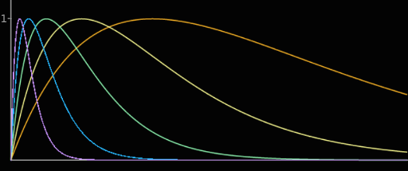

## About

Envelopes are an important component of timbres, an envelope is typically a curve which describe the loudness and spectral content of the sound over time.

Common synthesizers typically employ the ADSR envelope, an ADSR envelope consist of :

- **Attack time** is the time taken for initial run-up of level from nil to peak, beginning when the key is first pressed.
- **Decay time** is the time taken for the subsequent run down from the attack level to the designated sustain level.
- **Sustain level** is the level during the main sequence of the sound's duration, until the key is released.
- **Release time** is the time taken for the level to decay from the sustain level to zero after the key is released.

Envelopes can be used to precisely automate various parameters over time.

## How-to

Fragment allow any envelopes to be constructed by mathematically defining them, there is many other ways to construct envelopes from images, videos, sound, canvas content etc.

An excellent starting point to create such functions in a fragment shader is the *[useful little functions](http://www.iquilezles.org/www/articles/functions/functions.htm)* article written by Inigo Quilez

### AR-like envelope

One of the simplest envelope is AR (Attack and Release), there is many ways of constructing AR envelopes, for example with linear functions or with more interesting functions such as the exponential function.

Here is an example of a smooth AR envelope which use the impulse function



```glsl
// a simple function which define 
// smooth AR-like envelopes, fast attack and slow decays
// plot it or see the details of this function below
// it's maximum, which is 1.0, happens at exactly x = 1 / k
// use k to control the stretching of the function
float impulse(float k, float x) {
  float h = k * x;
  return h * exp(1.0 - h);
}

void main () {
  float l = 0.;
  float r = 0.;

  float attenuation_constant = 1.95;

  const float harmonics = 8.;

  for (int k = 0; k < 16; k += 2) {
    vec4 data = keyboard[k];

    float kfrq = data.x;
    float kvel = data.y;
    float ktim = data.z;
    float kchn = data.w;

    if (kfrq == 0.) {
     	break; 
    }

    // apply the envelope, this envelope has a fast attack
    // of ~62.5ms and a release of ~555ms
    float env_attack = ktim * 16.;
    float env = kvel * impulse(1., env_attack);

    for (float i = 1.; i < harmonics; i += 1.) {
      float a = 1. / pow(i, attenuation_constant);

      l += fline(kfrq * i) * a * env;
      r += fline(kfrq * i) * a * env;
    }
  }

  gl_FragColor = vec4(l, r, 0., 1.);
  synthOutput = vec4(l, r, 0., 0.);
}
```

### ADSR envelope

ADSR envelope is a classic and is the most commonly used envelope.

Example of a linear ADSR envelope

```
float adsr(float t, vec4 v, float s) {
  v.xyw = max(vec3(2.2e-05), v.xyw);
  // attack term
  float ta = t/v.x;
  // decay / sustain amplitude term
  float td = max(s, 1.0-(t-v.x)*(1.0-s)/v.y);
  // length / release term
  float tr = (1.0 - max(0.0,t-(v.x+v.y+v.z))/v.w);
  return max(0.0, min(ta, tr*td));
}

void main () {
  float l = 0.;
  float r = 0.;

  float attenuation_constant = 1.95;

  const float harmonics = 16.;

  for (int k = 0; k < 16; k += 2) {
    vec4 data = keyboard[k];

    float kfrq = data.x;
    float kvel = data.y;
    float ktim = data.z;
    float kchn = data.w;

    if (kfrq == 0.) {
      break; 
    }

    float mix_f = 0.5 * (1. + sin(ktim * 2.));

    for (float i = 1.; i < harmonics; i += 1.) {
      float a = 1. / pow(i, attenuation_constant * 1.1);
      
      float a2 = 1. / pow(i, attenuation_constant * 1.3);

      // the adsr function has three arguments
      // time, a vec4 with ADSR parameters and the value to decay to
      float attack = 0.25; // 250ms attack
      float decay = 1.; // 1 sec decay (to 0.25, see decay_amp)
      float sustain = 0.; // no sustain
      float release = 0.25; // 250ms release
      float decay_amp = 0.25;
      float env = kvel * adsr(ktim, vec4(attack, decay, sustain, release), decay_amp);

      a = mix(a, a2, mix_f);

      l += fline(kfrq * i) * a * env;
      r += fline(kfrq * i) * a * env;
    }
  }

  gl_FragColor = vec4(l, r, 0., 1.);
  synthOutput = vec4(l, r, 0., 0.);
}
```

## Note

The release term with MIDI keys in Fragment is actually dependent of the globally defined **note lifetime** settings, the note lifetime settings define the amount of time a note is kept in memory and this determine the maximum duration of the release portion of envelopes for MIDI keys, you can find this settings in the global settings dialog.