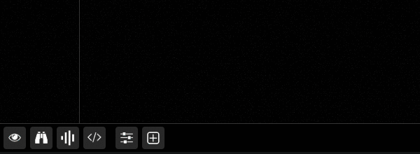

## About

The **fundamental** is the **simplest constituent** of a timbre (its pitch and lowest frequency) and also the fundamental building block to build the **partials**.

The fundamental and partials are all called **harmonics**.

## How-to

There is only one thing to do to produce a fundamental within Fragment: draw a horizontal line (or a pixel) anywhere on the Y axis of the canvas.

This is done by calling the `fline` function and passing the fundamental frequency as an argument, Fragment will draw a horizontal line which will correspond to the desired frequency.

Here is how to draw a horizontal line which will produce a fundamental 440Hz tone:

```glsl
void main () {
  float frequency = 440.;
  float l = 0.;
  float r = 0.;

  l += fline(frequency);
  r += fline(frequency);

  gl_FragColor = vec4(l, r, 0., 1.);
  synthOutput = vec4(l, r, 0., 0.);
}
```

- `frequency` is the desired frequency in Hertz
- `l` and `r`is the left and right output channel (stereo)

You can verify that the produced horizontal line is a 440Hz sine wave by toggling the axis details tool in the toolbar and pointing your cursor on the horizontal line:



### Note

You might be surprised to see that this is not exactly a 440Hz sine wave, the value is rounded due to the way the frequencies are mapped onto the canvas.

This can be fixed by increasing the score height, this will increase precision but this will require higher processing power.