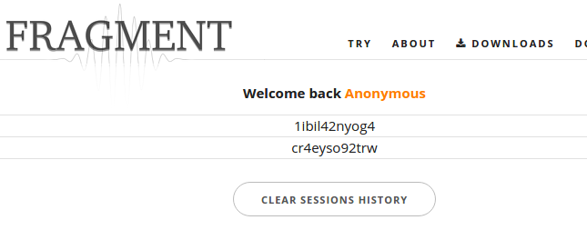

## About

Fragment sessions are isolated spaces which are open to everyone who has access to the session name, they can be joined by going to the Fragment [homepage](https://www.fsynth.com/) or by typing the session name directly into the address bar as demonstrated below.

Fragment store sessions content and settings on a server which mean that any of the synchronizable actions in the session such as the code editor content, canvas settings, slices and [uniform inputs](https://www.fsynth.com/documentation.html#uniformsdialog) are automatically saved **if** Fragment is connected.

Fragment can also be used locally if you don't like the online application, see the github repository

Fragment synchronize the code editor content, slices, canvas settings and [uniform inputs](https://www.fsynth.com/documentation.html#uniformsdialog) across all the users in the session in real-time which mean that you can jam with your friends if you share the session URL.

Note that MIDI note messages are not synchronized between users due to technical constraints but you can still add [uniform inputs](https://www.fsynth.com/documentation.html#uniformsdialog) and assign MIDI devices to control them, their values are synchronized between users.

Some settings are saved locally on your browser, some of them are global (like the username and settings related to the editor) and some of them are saved per sessions such as the MIDI settings, gain and inputs.

*Fragment is respectful of the user and does not store any informations related to the user outside the boundary defined by the application focus.*

## How-to

You can join any sessions directly from your browser address bar by replacing "yoursessionname" for the URL shown below by the session name you want to join or create, session names are limited to a maximum of 100 characters and cannot use the "$" character:

https://www.fsynth.com/app/**yoursessionname**

You can also join sessions with the Fragment launcher available as a download on the homepage.

The Fragment [homepage](https://www.fsynth.com/) or the Fragment launcher can be used to retrieve the various sessions that you joined, a session list will be shown once you joined at least one session.

You can join a session from the list by clicking on it and by clicking on the door icon.

You can remove a session from the list by clicking on it and by clicking on the trash icon.

You can also clear the sessions history by clicking on the corresponding button, it will not delete the session content, just your settings for that session and the session will removed from the list, a deleted session can be joined back from the homepage form or by the browser address bar if you know its name.

