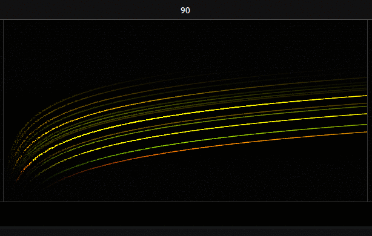
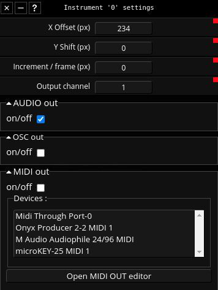
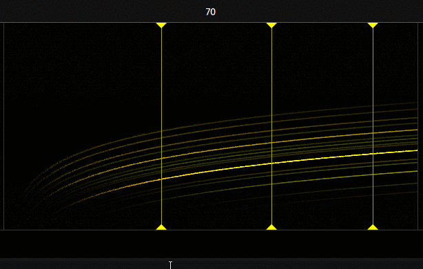

## About

Slices are an important part of Fragment, no sounds is produced if you don't add at least one slice.

The purpose of slices is to capture the pixels of vertical parts of the canvas, then the pixels will be fed to the audio synthesis engine, they are like turntable needles, they can be dragged around in real-time with the mouse.

When multiple slices are assigned to the same output channel, the pixels data is merged additively into one slice, this may result in non-wanted sounds with granular synthesis if not careful due to the addition of the Green and Alpha parameters.

## How-to

Slices can be moved by dragging them on the X axis, to do so, maintain the left mouse button on a slice and move the mouse cursor around on the horizontal axis.

Double-clicking on a slice open its settings dialog :

The following actions are possible by right-clicking on a slice

mute/unmute

- the synthesis engine will ignore a muted slice

slice settings dialog

- X Offset: the slice horizontal position

- Y Shift: pitch the slice audio up or down (there is no visual representation of this)

- Increment per frame: This allow the slice to move left or right by itself, this is the increment value per frames

- [FAS](https://www.fsynth.com/documentation.html#fas) Output channel: the l/r output channel which will be used by FAS for that slice

##### Muting a slice

##### Deleting a slice

