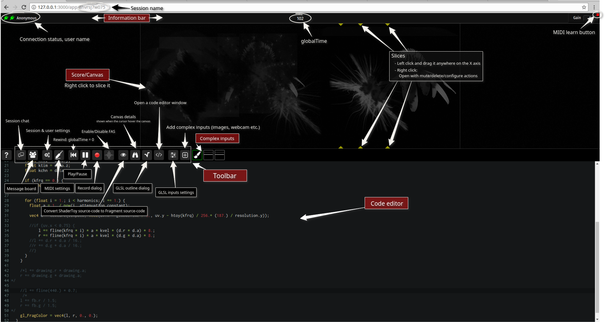
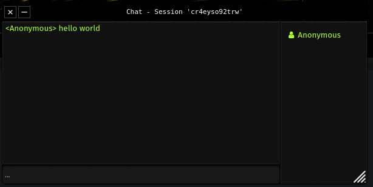

## About

Fragment user interface has a simple layout with five different parts.

## Layout

### Info. panel

The information panel at the top convey minor and major informations such as (in order from left to right)

- connectivity status for each services (DATA SERVER, SETTINGS SERVER, AUDIO SERVER)
    - a red color signal that the connection to this service failed
    - a green indicator signal that Fragment is currently connected to this service
    - the service name can be found by hovering the icon with the cursor
- username
    - the username can be edited by clicking on it (affect all sessions)
- various informations which can be enabled or disabled in the settings dialog such as
    - FAS CPU load
    - actual number of simultaneous MIDI notes for each channels (polyphony)
    - actual number of oscillators
    - cursor position and current frequency under the mouse cursor
- playback time (at the center)
- gain controller on the top right corner (master volume)

### Canvas / Graphical score

### Canvas

The canvas is a graphically accelerated surface of a chosen dimension where the output result of the Fragment script is displayed.

The canvas content is modified using the **gl_FragColor** or **fragColor** vec4 GLSL uniform in the code editor.

### Graphical score

The canvas is also a graphical score for bitmap-based sound synthesis.

The graphical score represent a kind of sonic canvas where the **X axis represent time** and the **Y axis represent frequencies**.

The frequency mapping is fixed and defined by the formula

Where:

- **a** is is the starting frequency
- **y** the vertical position
- **n** the number of oscillators (which is the height of the canvas)
- **o** the octave count

What you hear in Fragment is determined by the position of **instruments** (1px wide chunk of the canvas) added onto the graphical score, instruments are vertical chunks of the graphical score which capture bitmap-data from the score canvas and convert it to note events.

All added instruments are set to additive synthesis by default.

Instruments can be configured to output AUDIO (default), OSC data and custom MIDI data.

The score is a hidden surface which can be modified independently from the visual canvas using the **synthOutput** GLSL uniform.

Here are all the possible actions on the canvas :

* Double click : Open instruments dialog (which show an overview of all instruments)
* Right click : Open a menu with one button to add an instrument
    * Left click on the button will add an instrument
    * Middle click on the button will add a **muted** instrument
    * Right click on the button will add a **muted** instrument and open its settings dialog

### Toolbar

The toolbar is a collection of tools / settings, here is a detailed list of the toolbar items (in order from left to right)

- help
    - provide various helpers
- social
    - session live chat
    - direct link to the community online board
- settings
    - session settings and global settings
    - MIDI settings
- transport
    - reset playback time to 0
    - play/pause
    - spectral record
- synth
    - settings
- tools
    - [ShaderToy](https://www.shadertoy.com/) converter
    - canvas axis details (when enabled details appear when the canvas is hovered by the mouse pointer)
    - GLSL functions and uniforms outline dialog
        - open a dialog which list all **main** / **library** code definitions (variables, constants and functions), definitions can be clicked on to access them quickly in the code, all added code bookmarks are also shown here (see Code editor section below)
    - clone the code editor in a separate window
- import
    - inputs import dialog (inputs can be accessed with `texture(iInput0, vec2(uv.x, uv.y))` where 0 is the input ID)

### Input data

Fragment GLSL inputs are complex data (images, sounds transformed to images, videos, canvas etc.) imported from the import dialog.

The fragment input panel is a complete list of all added inputs, each of them appear as a thumbnail near the import button, nothing will be shown in the panel if no inputs were added.

All inputs can be used as a 2D texture (**texture** keyword) within the code editor (GLSL code editor or Processing.js code editor), they are pre-defined as **iInputN** where N is the id of the input starting from 0.

You can find the input id by hovering over the thumbnail or in the title of the input settings dialog.

Inputs can be ordered in real-time by drag & drop as shown above.

Inputs can be deleted quickly with a middle click on the input thumbnail.

### Collaborative Code editor

The code editor is one of the most important tool of Fragment, it allow to control the graphical canvas content and the spectral score which is fed to the sound synthesis server.

[GLSL](https://www.khronos.org/files/opengles_shading_language.pdf) code is what you type in the code editor to generate the visuals and sound synthesis data.

The fragment program is compiled as you type, if the compilation fail, the code editor will notice you with a floating message and a red message at the line that cause the compilation to fail, all of that without interrupting sounds/visuals output, this enable **powerful live coding**.

All changes in the code editor are automatically saved per sessions, **changes are also synchronized in real-time between all the users** of the session you are currently in, **this is the collaborative part of Fragment**.

The code editor is powered by the [CodeMirror](https://codemirror.net/) library, it feature many things such as:

- compilation as you type which does not interrupt sounds/visuals
- GLSL syntax highlighting
- highlight matches
- brackets/parentheses opening/end highlighting
- fullscreen editor by pressing F11
- integrated compilation errors/messages
- line numbers
- bookmarks (by clicking on the space next to line number, all bookmarks can be found in the outline dialog)
- many bundled editor themes

Some of the code editor features can be enabled/disabled in the global settings dialog.

If you experience audio stuttering as you type, it is recommended to detach the code editor off the main window or use the independent code editor tool.

### Workspaces

Workspaces panel contain the code, library and examples.

The code of the session can be found into **Code** and is named **main**, it is opened by default when any sessions is joined.

"My library" is a global **user** code library which is shared between sessions, definition of constants, variables or functions can be defined here to be used in the main code of any sessions. It is usefull to build a personal library of functions, constants etc.

Fragment come with many examples which can be found in the **Examples** part of the workspace, some examples may require some pre actions from the users as such it is recommended to read the first part of the example.

All additive examples does not require actions from the user and can be tried right away.

## Widgets

### Dialogs

Fragment has many dialogs, they are made of a title bar, a content and sometimes a status bar.

Dialogs hover above the rest of the application, you can move them by dragging the title bar around.

Dialogs also has dialog related actions in the titlebar, dialogs can be closed, some are also resizable, minimizable and detachable in a separate window.

Here is a list of dialog actions in the order by which they appear from left to right :

- close the dialog
- minimize/maximize the dialog
- detach the dialog in a new window
- direct link to the documentation section

To resize a dialogs, place the mouse cursor on the bottom right corner of the dialog, click and drag to the desired size.

### Input fields & MIDI learn

Inputs fields are widgets accepting user values. Some input fields turn red when the input value is out of range.

Some inputs have a red square which indicate MIDI learn functionality support for this widget

The red square appearing on an UI interface widget indicate that the MIDI learn functionality is supported for the widget, it only appear on WebMIDI enabled browsers such as Chrome and on widgets which are allowed to be controlled by MIDI.

By left clicking on the red square, it turn green and any inputs from enabled MIDI devices will be captured by the widget.

Once the MIDI input is captured, the green square become red again (a locked state) and the MIDI control will be assigned to the widget.

It is possible to reset the MIDI control assigned to the widget by clicking on the red square and clicking again on the green square (double click).