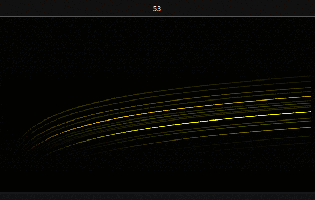
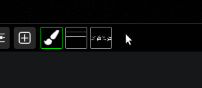
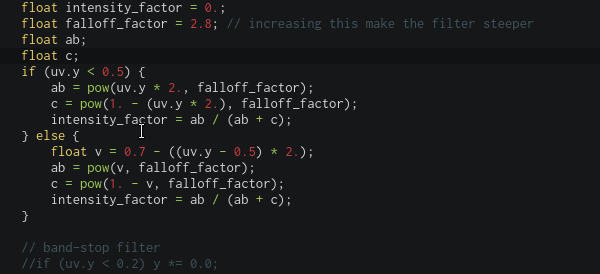

## About

Fragment user interface use a simple layout with five different parts.

## Layout

### Info. panel

The information panel at the top convey minor and major informations such as (in order from left to right)

- connectivity status
  - a red indicator signal that the connection to this service failed
  - a green indicator signal that Fragment is currently connected to this service
  - the service name can be found by hovering the icon with the cursor
- username
  - the username can be edited by clicking on it
- various informations which can be enabled or disabled in the settings dialog such as
  - FAS CPU load (if Fragment Audio Server is enabled)
  - the actual number of simultaneous MIDI notes for each channels (polyphony)
  - the actual number of oscillators
  - the current frequency under the mouse cursor
- the playback time (at the center)
- a gain controller (master volume)

### Canvas / Graphical score

### Canvas

The canvas is an area of a chosen dimension where the visual output is displayed.

### Graphical score

The canvas is also a graphical score for bitmap-based sound synthesis.

The graphical score represent a kind of sonic canvas where the **X axis represent time** and the **Y axis represent frequencies**.

The frequency mapping is fixed and defined by the formula

Where:

- **a** is is the starting frequency
- **y** the vertical position
- **n** the number of oscillators (which is the height of the canvas)
- **o** the octave count

What you hear in Fragment is determined by the position of **slices** added onto the graphical score, slices are vertical chunks of the graphical score which capture bitmap-data and convert it as note events.

The pixels are captured by the vertical slices, any number of **slices can be added on the canvas by right-clicking on it and by clicking on the + icon** as demonstrated above, this will add a vertical bar which will capture that score part.

With WebGL 2.0 support, the graphical score has a separate fragment shader **vec4** output called **synthOutput**.

### Toolbar

The toolbar is a collection of tools and settings which are grouped by sections, here is a detailed list of the toolbar items (in order from left to right)

- help
- social
  - session live chat
  - direct link to the community board
- settings
  - session settings and global settings
  - MIDI settings
- transport
  - reset playback time to 0
  - play/pause
  - spectral record
- audio server
  - connect/disconnect
  - settings
- helpers
  - [ShaderToy](https://www.shadertoy.com/) converter
  - canvas axis details (appear when the canvas is hovered by the cursor)
  - GLSL functions and uniforms outline dialog
  - clone the code editor in a separate window
- fragment inputs
  - inputs import dialog (can be accessed with `texture(iInput0, vec2(uv.x, uv.y))` where 0 is the input ID)

### Inputs

Fragment GLSL inputs are complex data (images, sounds transformed to images, videos, canvas etc.) imported from the GLSL inputs import dialog.

The fragment input panel is a complete list of all the added inputs, each of them appear as a thumbnail near the import button, nothing will be shown in the panel if no inputs were added.

All GLSL inputs can be used as a 2D texture (**texture** keyword) within the fragment program, they are pre-defined as **iInputN** where N is the id of the input starting from 0.

You can find the input id by hovering over the thumbnail or in the title of the complex input settings dialog.

GLSL inputs can be ordered in real-time by drag & drop as shown above.

### Collaborative Code editor

The code editor is one of the most important tool of Fragment, it allow the user to generate the visuals which are then fed to the audio synthesis engine.

[GLSL](https://www.khronos.org/files/opengles_shading_language.pdf) code is what you type in the code editor to generate the visuals and sound synthesis data.

The fragment program is compiled as you type, if the compilation fail, the code editor will notice you with a floating message and a red message at the line that cause the compilation to fail, all of that without interrupting sounds/visuals output, this enable **powerful live coding**.

The changes that you make in the code editor are automatically saved per sessions, **changes are also synchronized in real-time between all the users** of the session you are currently in, **this is the collaborative nature of Fragment**.

The code editor is powered by the [CodeMirror](https://codemirror.net/) library, it feature many things such as:

- compilation as you type which does not interrupt sounds/visuals
- GLSL syntax highlighting
- highlight matches
- brackets/parentheses opening/end highlighting
- fullscreen editor by pressing F11
- integrated compilation errors/messages
- line numbers
- many bundled editor themes

Some of the code editor features can be enabled/disabled in the global settings dialog.

If you experience audio stuttering as you type, it is recommended to detach the code editor off the main window or use the independent code editor tool.

## Widgets

### Dialogs

Fragment has many dialogs, they are made of a title bar, a content and sometimes a status bar.

Dialogs hover above the rest of the application, you can move them by dragging the title bar around.

Dialogs has some dialog related actions in the titlebar, dialogs can be closed, some are also resizable, minimizable and detachable in a separate window.

Here is a list of dialog actions in the order by which they appear from left to right :

- close the dialog
- minimize/maximize the dialog
- detach the dialog in a new window
- direct link to the documentation section

To resize a dialogs, place the mouse cursor on the bottom right corner of the dialog, click and drag to the desired size.

### Inputs & MIDI learn

Inputs are widgets accepting user values.

Some inputs have a red square which indicate MIDI learn functionality support for this widget

The red square appearing on an UI interface widget indicate that the MIDI learn functionality is supported for the widget, it only appear on WebMIDI enabled browsers such as Chrome and Opera and on widgets which are allowed to be controlled by MIDI.

By left clicking on the red square, it turn green and any inputs from enabled MIDI devices will be captured by the widget.

Once the MIDI input is captured, the green square become red again (a locked state) and the MIDI control will be assigned to the widget.

It is possible to reset the MIDI control assigned to the widget by clicking on the red square and clicking again on the green square aka double clicking.